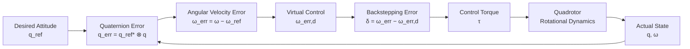

<p align="center">
  
</p>


# Quaternion-Based Attitude Tracking Control for a Quadrotor UAV

## Team Members

| Name | Roll Number ||
|---|---|---|
| N.Supreeth | CB.SC.U4AIE24139 ||
| P.Rohit | CB.SC.U4AIE24145 ||
| B.Nikhil | CB.SC.U4AIE24063 ||
| M.Phanendhra | CB.SC.U4AIE24032 ||
| D.Koushik | CB.SC.U4AIE24167 ||

---

# Title

## Quaternion-Based Attitude Tracking Control for a Quadrotor UAV

---

# Abstract

Quadrotor UAVs require accurate attitude control to maintain and change their orientation during flight. This project investigates a quaternion-based attitude tracking controller using a backstepping control approach.

Quaternions are used to represent the orientation of the quadrotor because they provide a compact representation of three-dimensional rotations without the singularities associated with Euler angles. The controller uses the difference between the desired and actual quaternion to determine the attitude error and then generates a desired angular velocity through a virtual control law.

A second backstepping stage is used to calculate the required control torque while accounting for the nonlinear rotational dynamics of the quadrotor. A fractional-power feedback term is included to reduce the backstepping error.

The complete controller is implemented and evaluated through numerical simulation in MATLAB. The simulation examines quaternion error, angular velocity tracking error, backstepping error, and control torque.

---

# Introduction

A quadrotor UAV is an underactuated nonlinear system whose motion depends on the interaction between its position, orientation, angular velocity, and control inputs. Among these, attitude control is particularly important because the orientation of the vehicle determines the direction in which the generated thrust acts.

The attitude of a quadrotor can be represented using Euler angles, rotation matrices, or quaternions. Although Euler angles are intuitive, they can suffer from gimbal lock. Quaternions provide an alternative representation that is well suited for describing three-dimensional orientation and nonlinear attitude control.

In this project, the attitude is represented using a unit quaternion:

```math
q = [q_0,\ q_1,\ q_2,\ q_3]^T
```

with the unit-quaternion constraint:

```math
\lVert q\rVert =
\sqrt{q_0^2 + q_1^2 + q_2^2 + q_3^2}
= 1
```

The main objective is to make the actual quadrotor attitude follow a desired attitude trajectory while ensuring that the angular velocity tracking error is reduced.

The control strategy is based on backstepping. Since torque directly affects angular velocity and angular velocity determines the evolution of the attitude, the controller is developed in stages. The first stage generates a desired angular velocity from the quaternion attitude error. The second stage determines the control torque required to make the actual angular velocity follow this desired behaviour.

This project is based on the research paper **"Quaternion-Based Attitude Tracking Control Design for UAVs"** by Qain-Rong Lin and Jen-te Yu, presented at the 2024 International Automatic Control Conference (CACS 2024).

---

# Methodology

## 1. Quaternion Representation

The quadrotor attitude is represented by a unit quaternion:

```math
q = [q_0,\ q_1,\ q_2,\ q_3]^T
```

The quaternion conjugate is given by:

```math
q^* =
[q_0,\ -q_1,\ -q_2,\ -q_3]^T
```

For a unit quaternion, the inverse is equal to its conjugate:

```math
q^{-1} = q^*
```

During numerical simulation, quaternion normalization is applied to maintain the unit-quaternion constraint:

```math
q_{\mathrm{norm}} =
\frac{q}{\lVert q\rVert}
```

---

## 2. Quaternion Multiplication

The multiplication of two quaternions is written as:

```math
q_1 \otimes q_2
```

For:

```math
q_1 = [a,\ b,\ c,\ d]^T
```

and:

```math
q_2 = [e,\ f,\ g,\ h]^T
```

their product is:

```math
q_1 \otimes q_2 =
\begin{bmatrix}
ae-bf-cg-dh \\
af+be+ch-dg \\
ag-bh+ce+df \\
ah+bg-cf+de
\end{bmatrix}
```

Quaternion multiplication is non-commutative:

```math
q_1 \otimes q_2 \neq q_2 \otimes q_1
```

Therefore, the order of multiplication is important when calculating the attitude error.

---

## 3. Quadrotor Attitude Dynamics

The attitude evolution is described using quaternion kinematics:

```math
\dot{q}
=
\frac{1}{2}
q \otimes
\begin{bmatrix}
0 \\
\omega
\end{bmatrix}
```

where $q$ represents the current attitude quaternion and $\omega$ represents the angular velocity.

The rotational dynamics of the quadrotor are described by:

```math
\dot{\omega}
=
J^{-1}
\left[
\tau-\omega\times(J\omega)
\right]
```

where:

- $J$ is the inertia matrix.
- $\omega$ is the angular velocity.
- $\tau$ is the applied control torque.
- $\omega\times(J\omega)$ represents the gyroscopic term.

These two equations form the rotational model used in the closed-loop simulation.

---

## 4. Quaternion Attitude Error

The desired attitude is represented by the reference quaternion $q_{\mathrm{ref}}$.

The quaternion tracking error is calculated as:

```math
q_{\mathrm{err}}
=
q_{\mathrm{ref}}^*
\otimes q
```

When the actual and desired attitudes are identical:

```math
q = q_{\mathrm{ref}}
```

the error becomes the identity quaternion:

```math
q_{\mathrm{err}}
=
[1,\ 0,\ 0,\ 0]^T
```

Therefore, the controller aims to drive the quaternion error toward the identity quaternion.

---

## 5. Angular Velocity Error

The angular velocity tracking error is defined as:

```math
\omega_{\mathrm{err}}
=
\omega-\omega_{\mathrm{ref}}
```

where $\omega_{\mathrm{ref}}$ is the desired angular velocity.

The desired tracking condition is:

```math
\omega_{\mathrm{err}}
\rightarrow 0
```

---

## 6. Quaternion Error Dynamics

The quaternion error dynamics connect the attitude error with the angular velocity error:

```math
\dot{q}_{\mathrm{err}}
=
\frac{1}{2}
q_{\mathrm{err}}
\otimes
\begin{bmatrix}
0 \\
\omega_{\mathrm{err}}
\end{bmatrix}
```

This relationship provides the basis for the first stage of the backstepping controller.

---

## 7. Backstepping Controller

The controller is developed in two stages.

The first stage uses the quaternion attitude error to generate a desired angular velocity error. The second stage uses the difference between the actual and desired angular velocity errors to calculate the required control torque.

The backstepping error is defined as:

```math
\delta
=
\omega_{\mathrm{err}}
-
\omega_{\mathrm{err},d}
```

where $\omega_{\mathrm{err},d}$ is the desired angular velocity error generated by the virtual controller.

---

## 8. Virtual Control

The virtual control is defined by:

```math
\begin{bmatrix}
0 \\
\omega_{\mathrm{err},d}
\end{bmatrix}
=
-k_1
q_{\mathrm{err}}^*
\otimes
(q_{\mathrm{err}}-q_i)
```

where:

```math
q_i =
[1,\ 0,\ 0,\ 0]^T
```

and $k_1>0$ is the first control gain.

The purpose of this virtual control is to drive the quaternion error toward the identity quaternion.

The resulting desired quaternion error behaviour is:

```math
\dot{q}_{\mathrm{err}}
=
-\frac{k_1}{2}
(q_{\mathrm{err}}-q_i)
```

---

## 9. Backstepping Error Dynamics

The backstepping error is:

```math
\delta
=
\omega_{\mathrm{err}}
-
\omega_{\mathrm{err},d}
```

Differentiating gives:

```math
\dot{\delta}
=
\dot{\omega}_{\mathrm{err}}
-
\dot{\omega}_{\mathrm{err},d}
```

Since:

```math
\omega_{\mathrm{err}}
=
\omega-\omega_{\mathrm{ref}}
```

we obtain:

```math
\dot{\omega}_{\mathrm{err}}
=
\dot{\omega}
-
\dot{\omega}_{\mathrm{ref}}
```

Using the rotational dynamics:

```math
\dot{\omega}
=
J^{-1}
\left[
\tau-\omega\times(J\omega)
\right]
```

the backstepping error dynamics become:

```math
\dot{\delta}
=
J^{-1}
\left[
\tau-\omega\times(J\omega)
\right]
-
\dot{\omega}_{\mathrm{ref}}
-
\dot{\omega}_{\mathrm{err},d}
```

---

## 10. Control Torque

The control torque is divided into a dynamics compensation component and an error convergence component:

```math
\tau=\tau_1+\tau_2
```

The first component compensates for the nonlinear rotational dynamics and reference motion:

```math
\tau_1
=
\omega\times(J\omega)
+
J\dot{\omega}_{\mathrm{ref}}
+
J\dot{\omega}_{\mathrm{err},d}
```

The second component provides error convergence:

```math
\tau_2
=
-k_2J\delta^{1/3}
```

where $k_2>0$.

Combining the two components gives the final control law:

```math
\tau
=
\omega\times(J\omega)
+
J\dot{\omega}_{\mathrm{ref}}
+
J\dot{\omega}_{\mathrm{err},d}
-
k_2J\delta^{1/3}
```

The resulting backstepping error dynamics are:

```math
\dot{\delta}
=
-k_2\delta^{1/3}
```

The control law therefore works to reduce the backstepping error while compensating for the nonlinear rotational dynamics.

---

## 11. Reference Trajectory

The reference angular velocity consists of three sinusoidal signals.

It is represented as:

```math
\omega_{\mathrm{ref}}
=
\begin{bmatrix}
\omega_{\mathrm{ref},1} \\
\omega_{\mathrm{ref},2} \\
\omega_{\mathrm{ref},3}
\end{bmatrix}
```

and its derivative is:

```math
\dot{\omega}_{\mathrm{ref}}
=
\frac{d\omega_{\mathrm{ref}}}{dt}
```

The reference trajectory provides the desired motion that the controller attempts to track.

---

## 12. Simulation Setup

The numerical simulation uses the following parameters:

| Parameter | Value |
|---|---:|
| Inertia matrix $J$ | $\mathrm{diag}(0.1,\ 0.1,\ 0.12)$ |
| Controller gain $k_1$ | 20 |
| Controller gain $k_2$ | 2 |

Initial angular velocity:

```math
\omega(0)
=
[-0.1,\ -0.2,\ 0.2]^T
```

Initial reference angular velocity:

```math
\omega_{\mathrm{ref}}(0)
=
[-0.1,\ -0.2,\ 0.2]^T
```

Initial quaternion:

```math
q(0)
=
[0.94628,\ -0.1541,\ 0.19051,\ -0.21098]^T
```

Initial reference quaternion:

```math
q_{\mathrm{ref}}(0)
=
[0.94628,\ -0.1541,\ 0.19051,\ -0.21098]^T
```

---

# Results

The closed-loop simulation evaluates the attitude tracking and controller performance using quaternion error, angular velocity error, backstepping error, and control torque.

The controller is expected to drive the quaternion error toward the identity quaternion:

```math
q_{\mathrm{err}}
\rightarrow
[1,\ 0,\ 0,\ 0]^T
```

The angular velocity tracking error is expected to approach zero:

```math
\omega_{\mathrm{err}}
\rightarrow
[0,\ 0,\ 0]^T
```

The backstepping error is expected to converge toward zero:

```math
\delta
\rightarrow
[0,\ 0,\ 0]^T
```

The control torque should decrease as the system approaches the desired trajectory.

According to the results reported in the research paper, the angular velocity error approaches zero at approximately **0.8 seconds**, while the backstepping error approaches zero at approximately **0.4 seconds**. The reported results also show convergence of the quaternion error toward the identity quaternion and reduction of the control torque as the system reaches the desired behaviour.

The simulation therefore provides a way to evaluate how effectively the quaternion-based backstepping controller tracks the prescribed attitude trajectory.

---

# Conclusion

This project presents a quaternion-based backstepping controller for attitude tracking of a quadrotor UAV.

The quadrotor rotational motion is modelled using quaternion kinematics and nonlinear rotational dynamics. Quaternion error is used to measure the difference between the actual and desired attitudes, while angular velocity error is used to measure the difference in rotational motion.

The controller uses a two-stage backstepping approach. First, a virtual control generates the desired angular velocity error from the quaternion error. The second stage calculates the required control torque using the backstepping error, nonlinear dynamics compensation, reference motion, and a fractional-power feedback term.

The final control law is:

```math
\tau
=
\omega\times(J\omega)
+
J\dot{\omega}_{\mathrm{ref}}
+
J\dot{\omega}_{\mathrm{err},d}
-
k_2J\delta^{1/3}
```

with:

```math
\delta
=
\omega_{\mathrm{err}}
-
\omega_{\mathrm{err},d}
```

The simulation results demonstrate the expected convergence of the tracking errors and provide a basis for evaluating the controller's performance.

---



# Research Paper

**Quaternion-Based Attitude Tracking Control Design for UAVs**

**Authors:** Qain-Rong Lin and Jen-te Yu

**Conference:** 2024 International Automatic Control Conference (CACS 2024)

**Location:** National Taiwan University of Science and Technology, Taipei

**Date:** November 1–3, 2024

**DOI:** 10.1109/CACS63404.2024.10773309
